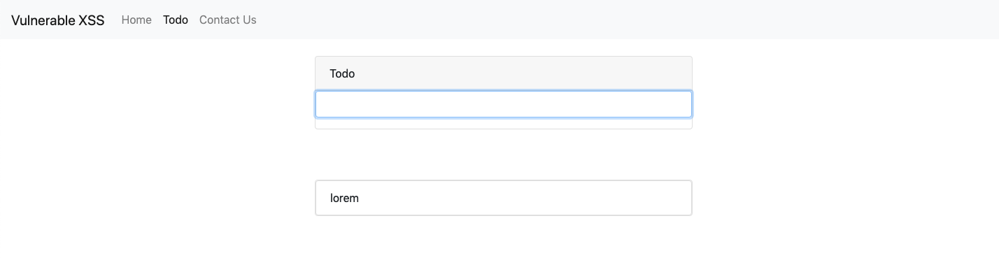
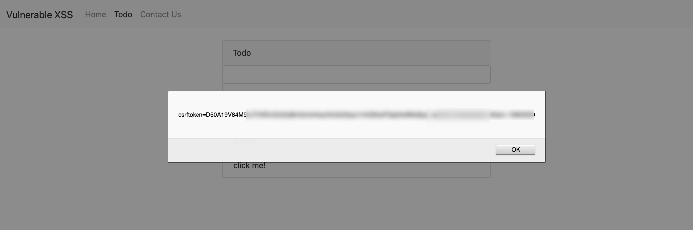

# DOM Based XSS

#### Step 1:

* Click `Todo` icon
* Enter a genuine value

   

* Now we can Enter a `DOM XSS` payload

```commandline
<a onmouseover=alert(document.cookie)>click me!</a>
```

* Then mouseover on the `click me!` text

    
