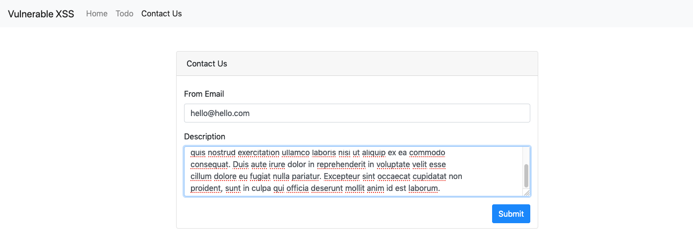
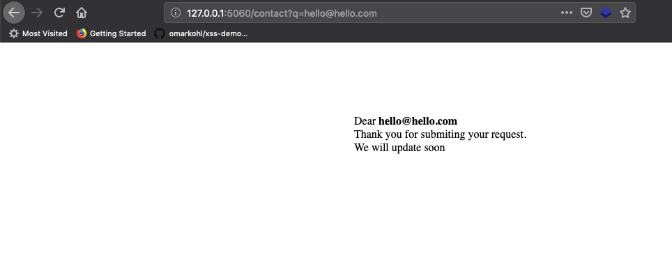
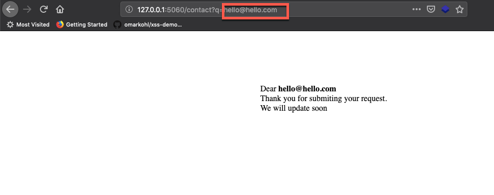
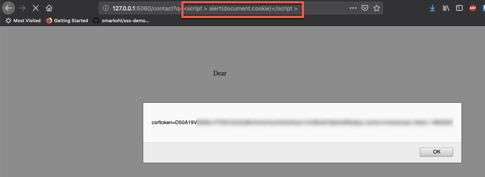

# Reflected XSS

#### Step 1:

* Click `Contact Us` icon
* Enter a genuine value

   


* It will redirect into a information page
    
    

* Now we can Enter a `Reflected XSS` payload in the url header
    
    

```commandline
<script > alert(document.cookie)</script >
```

* Once you enter the payload 

    
